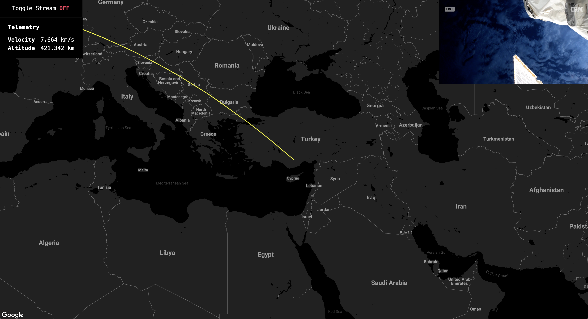

# Raspberry Pi ISS Tracking Dashboard

Dashboard for tracking and steaming video from the International Space Station

## Installation

Run the following commands

`cp .env.example .env.local`

`npm install`

**Note:** You will need a Google Map API key to add to the .env.local

## Running the Dashboard in Kiosk Mode

Run `npm start`
